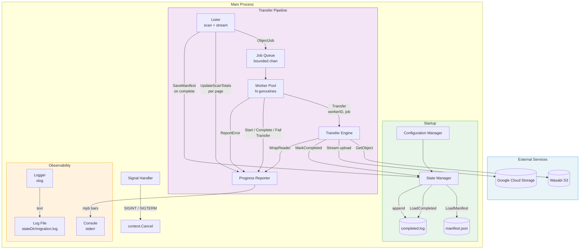
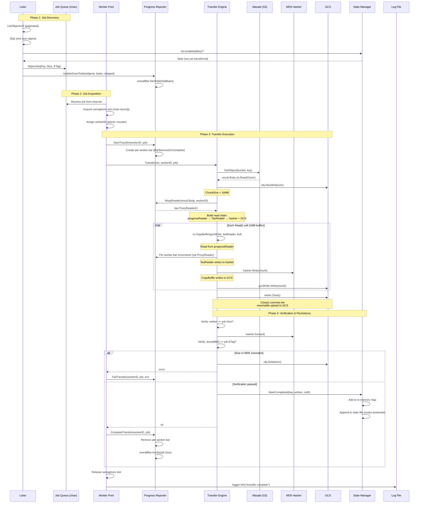

# Wasabi to GCS Migration Tool - Design Specification

## Overview

A high-performance, reliable tool for migrating large volumes of objects from Wasabi (S3-compatible) to Google Cloud Storage. Designed for correctness, resumability, and true parallelism.

**Go Version:** 1.22+ (uses modern idioms from Go 1.21+)

## Goals

1. **Correctness First**: Never report success when transfer failed
2. **True Parallelism**: Workers must not block each other on I/O
3. **Resumability**: Gracefully handle interruptions and resume without re-transferring
4. **Observability**: Structured logging and live progress bars
5. **Efficiency**: Minimize API calls, memory usage, and I/O overhead

## Non-Goals

- Bidirectional sync (this is one-way migration only)
- Real-time continuous sync
- File transformation during transfer

---

## Modern Go Idioms & Conventions

### Structured Logging with `log/slog` (Go 1.21+)
All logging uses the standard library's structured logger for consistency and parseability:

```go
import "log/slog"

// Create logger with text output for readability (writes to log file, not stdout)
logger := slog.New(slog.NewTextHandler(logFile, &slog.HandlerOptions{
    Level: slog.LevelInfo,
}))

// Contextual logging with attributes
logger.Info("transfer complete",
    slog.String("key", job.Key),
    slog.Int64("bytes", written),
    slog.Duration("elapsed", elapsed),
)
```

### Error Handling with `errors.Is` / `errors.As`
Use wrapped errors and semantic checking:

```go
import "errors"

// Define sentinel errors
var (
    ErrBucketNotFound   = errors.New("bucket not found")
    ErrPermissionDenied = errors.New("permission denied")
    ErrRateLimited      = errors.New("rate limited")
)

// Wrap errors with context
if err != nil {
    return fmt.Errorf("get object %s: %w", key, err)
}

// Check error types for retry logic
func isRetryable(err error) bool {
    if errors.Is(err, context.DeadlineExceeded) {
        return true
    }
    var apiErr *smithy.GenericAPIError
    if errors.As(err, &apiErr) {
        switch apiErr.Code {
        case "503", "429", "500":
            return true
        }
    }
    return false
}
```

### Context Propagation
All operations accept context for cancellation and deadlines:

```go
func (m *Migrator) Run(ctx context.Context) error {
    // Create cancellable context for graceful shutdown
    ctx, cancel := context.WithCancel(ctx)
    defer cancel()

    // Propagate context to all subsystems
    g, ctx := errgroup.WithContext(ctx)
    // ...
}
```

### Interface-Based Design for Testability
Define narrow interfaces at point of use:

```go
// Only what we need from the S3 client
type ObjectGetter interface {
    GetObject(ctx context.Context, input *s3.GetObjectInput) (*s3.GetObjectOutput, error)
}

// Easy to mock in tests
type mockGetter struct {
    data []byte
    err  error
}
```

---

## Architecture

```
┌──────────────────────────────────────────────────────────────────────────────────┐
│                                Main Process                                      │
├──────────────────────────────────────────────────────────────────────────────────┤
│                                                                                  │
│  ┌────────────────┐                                                             │
│  │ Signal Handler │──── SIGINT/SIGTERM ──▶ context.Cancel()                     │
│  └────────────────┘                                                             │
│                                                                                  │
│  ┌──────────────┐  scan   ┌──────────────┐    ┌──────────────────────┐          │
│  │   Lister     │─totals─▶│   Progress   │    │                      │          │
│  │ (scan+stream)│         │   Reporter   │◀───│   Worker Pool        │          │
│  └──────┬───────┘         └──────┬───────┘    │   (N workers)        │          │
│         │ jobs                   │ stderr     └──────────┬───────────┘          │
│         ▼                        ▼                       │                      │
│  ┌──────────────┐         ┌──────────────┐    ┌──────────────────────┐          │
│  │  Job Queue   │────────▶│   Console    │    │   Transfer Engine    │          │
│  │  (bounded)   │         │   (stderr)   │    │   (per worker)       │          │
│  └──────────────┘         └──────────────┘    └──────────────────────┘          │
│                                                          │                      │
│  ┌──────────────┐         ┌──────────────┐               │                      │
│  │    Logger    │────────▶│   Log File   │               │                      │
│  │   (slog)    │         │  (stateDir)  │               │                      │
│  └──────────────┘         └──────────────┘               │                      │
│                                                          ▼                      │
│  ┌──────────────┐    ┌──────────────┐                                           │
│  │   Manifest   │◀──▶│ State Manager│                                           │
│  │  (manifest   │    │  (append I/O)│                                           │
│  │   .json)     │    └──────┬───────┘                                           │
│  └──────────────┘           │                                                   │
│                             ▼                                                   │
│                      ┌──────────────┐                                           │
│                      │  State File  │                                           │
│                      │   (append)   │                                           │
│                      └──────────────┘                                           │
└──────────────────────────────────────────────────────────────────────────────────┘
```

### Architecture Diagram (Mermaid)



### Transfer Data Flow

This section describes the complete lifecycle of a single object transfer, from the moment a worker picks up a job to the final state persistence.

#### Sequence Diagram (Mermaid)



#### Step-by-Step Walkthrough

When a worker goroutine picks up an `ObjectJob` from the bounded channel, the following sequence occurs:

**1. Semaphore Acquisition**

The worker acquires a slot from the buffered channel semaphore (`chan struct{}`). This blocks if all `N` worker slots are in use. Once acquired, the worker increments `activeWorkers` and assigns itself a unique `workerID` via an atomic counter.

**2. Progress Bar Creation**

The worker calls `progress.StartTransfer(workerID, job)`, which creates a dedicated per-worker progress bar in the mpb container. The bar shows the truncated filename (last 40 chars), percentage, byte counters, and transfer speed. This bar renders on stderr beneath the overall progress bar.

**3. Transfer Engine: Download from Wasabi**

The worker calls `engine.Transfer(ctx, workerID, job)`, which enters the retry loop (up to `maxRetries` attempts with exponential backoff + full jitter). Inside `doTransfer`:

- **S3 GetObject**: Sends an HTTP GET to Wasabi for the object. Returns an `io.ReadCloser` as `result.Body` — the body is *not* buffered in memory; it streams directly from the TCP connection.
- **Content-Type preservation**: If the source object has a content type, it's copied to the GCS writer.

**4. Streaming Pipeline Assembly**

The transfer engine constructs a zero-copy streaming pipeline:

```
Wasabi TCP → result.Body → progressReader → teeReader ─┬─→ hasher (MD5)
                                                         └─→ gcsWriter → GCS
```

- **`progress.WrapReader(result.Body, workerID)`**: Wraps the body in `bar.ProxyReader()`, which intercepts every `Read()` call to increment the per-worker progress bar by the number of bytes read.
- **`io.TeeReader(progressReader, hasher)`**: Forks the stream — every byte read from the teeReader is simultaneously written to the MD5 hasher. No extra copy occurs; `TeeReader` writes to the hasher inside its own `Read()` implementation.
- **Buffer from pool**: A 1MB buffer is borrowed from the shared `sync.Pool`. This buffer is the *only* memory allocation per transfer — it's reused across the entire streaming pipeline via `io.CopyBuffer`.

**5. Streaming Transfer**

`io.CopyBuffer(gcsWriter, teeReader, buf)` drives the pipeline:

1. Reads up to 1MB from `teeReader` into `buf`
2. The `teeReader`'s `Read()` reads from `progressReader`, which reads from `result.Body` (Wasabi TCP)
3. The `teeReader`'s `Read()` writes the same bytes to `hasher` (MD5 computation)
4. The `progressReader`'s `Read()` increments the per-worker progress bar
5. `CopyBuffer` writes `buf` contents to `gcsWriter` (GCS upload)
6. The GCS writer accumulates bytes into 16MB chunks and uploads each chunk as part of a resumable upload

This loop repeats until EOF. At steady state, data flows directly from Wasabi's TCP socket through the pipeline to GCS — the 1MB buffer is the only intermediate storage.

**6. Upload Finalization**

`gcsWriter.Close()` is called, which:
- Flushes any remaining bytes in the GCS writer's internal buffer
- Commits the resumable upload to GCS (sends the final chunk with the upload complete signal)
- **This is the critical point** — if `Close()` returns an error, the upload did not persist to GCS even if all `Write()` calls succeeded

**7. Integrity Verification**

Two checks are performed *after* the upload is committed:

- **Size verification**: `written` (returned by `io.CopyBuffer`) must equal `job.Size` (from the source listing). A mismatch means bytes were lost or duplicated in transit.
- **MD5 verification**: The hex-encoded hash from `hasher.Sum(nil)` is compared against the object's ETag (stripping quotes). Multipart-uploaded objects have ETags containing `-` and are skipped for MD5 verification since their ETags are not simple MD5 hashes.

If either check fails, the corrupted object is deleted from GCS and the error is returned to the retry loop.

**8. State Persistence**

On success, `state.MarkCompleted(key, written, md5)` is called:
- Adds the key and its size to the in-memory `completed` map (protected by `sync.Mutex`)
- Appends a completion record directly to `completed.log` (same mutex)

**9. Progress Update and Cleanup**

Back in the worker pool:
- `progress.CompleteTransfer(workerID, job)`: Marks the per-worker bar as complete (removed from display via `BarRemoveOnComplete`), then increments the overall bar by `job.Size` bytes
- The semaphore slot is released, allowing another goroutine to start
- A structured log entry is written to the log file with the key, bytes transferred, and elapsed duration

#### Retry Behavior

If `doTransfer` returns a retryable error (network timeout, 5xx, 429, SlowDown), the retry loop in `Transfer()`:

1. Calculates backoff: `base * 2^(attempt-1)`, capped at 30s
2. Applies full jitter: random value in `[0, backoff)` to prevent thundering herd
3. Waits (respecting context cancellation)
4. Retries the entire `doTransfer` — this means a fresh `GetObject` call to Wasabi and a new GCS writer. No partial state is reused between attempts.

Non-retryable errors (permission denied, not found, context cancelled) fail immediately without retry.

#### Memory Profile Per Transfer

| Component | Memory | Lifetime |
|-----------|--------|----------|
| `ObjectJob` struct | ~120 bytes | Channel → worker |
| 1MB buffer (from pool) | 1 MB | Borrowed during transfer |
| MD5 hasher state | 128 bytes | Per transfer |
| GCS writer internal buffer | 16 MB (chunks) | Per transfer |
| Per-worker progress bar | ~500 bytes | Transfer duration |
| **Total per active worker** | **~17 MB** | |

With 10 workers, peak memory for active transfers is approximately 170 MB, dominated by GCS writer chunk buffers.

### Graceful Shutdown

```go
func main() {
    ctx, cancel := context.WithCancel(context.Background())
    defer cancel()

    // Handle shutdown signals
    sigCh := make(chan os.Signal, 1)
    signal.Notify(sigCh, syscall.SIGINT, syscall.SIGTERM)

    go func() {
        sig := <-sigCh
        slog.Info("shutdown signal received", slog.String("signal", sig.String()))
        cancel()

        // Force exit after grace period
        <-time.After(30 * time.Second)
        slog.Error("graceful shutdown timed out, forcing exit")
        os.Exit(1)
    }()

    if err := run(ctx); err != nil && !errors.Is(err, context.Canceled) {
        slog.Error("migration failed", slog.Any("error", err))
        os.Exit(1)
    }
}
```

---

## Core Components

### 1. Configuration Manager

**Responsibilities:**
- Parse and validate command-line flags
- Support environment variables as fallback
- Fail fast on missing required parameters
- Provide sensible defaults

**Implementation with Validation:**

```go
type Config struct {
    // Source (Wasabi)
    WasabiEndpoint  string
    WasabiRegion    string
    WasabiAccessKey string
    WasabiSecretKey string
    WasabiBucket    string

    // Destination (GCS)
    GCSProject string
    GCSBucket  string

    // Transfer settings
    Prefix     string
    Workers    int
    MaxRetries int
    StateDir   string
    DryRun     bool

    // Observability
    Logger   *slog.Logger
    LogLevel slog.Level

    // Console behavior
    Verbose bool   // Show real-time log lines in terminal alongside progress bars
    Rescan  bool   // Force re-enumeration of source bucket, ignore cached manifest
}

// Validate checks all required fields and constraints
func (c *Config) Validate() error {
    var errs []error

    // Required fields
    if c.WasabiEndpoint == "" {
        errs = append(errs, errors.New("wasabi-endpoint is required"))
    }
    if c.WasabiRegion == "" {
        errs = append(errs, errors.New("wasabi-region is required"))
    }
    if c.WasabiAccessKey == "" {
        errs = append(errs, errors.New("wasabi-access-key is required"))
    }
    if c.WasabiSecretKey == "" {
        errs = append(errs, errors.New("wasabi-secret-key is required"))
    }
    if c.WasabiBucket == "" {
        errs = append(errs, errors.New("wasabi-bucket is required"))
    }
    if c.GCSBucket == "" {
        errs = append(errs, errors.New("gcs-bucket is required"))
    }

    // Constraints
    if c.Workers < 1 || c.Workers > 100 {
        errs = append(errs, fmt.Errorf("workers must be 1-100, got %d", c.Workers))
    }
    if c.MaxRetries < 0 || c.MaxRetries > 10 {
        errs = append(errs, fmt.Errorf("max-retries must be 0-10, got %d", c.MaxRetries))
    }

    // Validate endpoint URL
    if c.WasabiEndpoint != "" {
        if _, err := url.Parse(c.WasabiEndpoint); err != nil {
            errs = append(errs, fmt.Errorf("invalid wasabi-endpoint URL: %w", err))
        }
    }

    // Check state directory is writable
    if c.StateDir != "" {
        if err := os.MkdirAll(c.StateDir, 0755); err != nil {
            errs = append(errs, fmt.Errorf("cannot create state-dir: %w", err))
        }
        testFile := filepath.Join(c.StateDir, ".write-test")
        if err := os.WriteFile(testFile, []byte("test"), 0644); err != nil {
            errs = append(errs, fmt.Errorf("state-dir not writable: %w", err))
        }
        os.Remove(testFile)
    }

    return errors.Join(errs...)
}

// ParseFlags parses command-line flags and environment variables
func ParseFlags() (*Config, error) {
    cfg := &Config{
        Workers:    10,
        MaxRetries: 3,
        StateDir:   "./migration_state",
        LogLevel:   slog.LevelInfo,
    }

    flag.StringVar(&cfg.WasabiEndpoint, "wasabi-endpoint", "", "Wasabi S3 endpoint URL")
    flag.StringVar(&cfg.WasabiRegion, "wasabi-region", "", "Wasabi region")
    flag.StringVar(&cfg.WasabiAccessKey, "wasabi-access-key", os.Getenv("WASABI_ACCESS_KEY"), "Wasabi access key")
    flag.StringVar(&cfg.WasabiSecretKey, "wasabi-secret-key", os.Getenv("WASABI_SECRET_KEY"), "Wasabi secret key")
    flag.StringVar(&cfg.WasabiBucket, "wasabi-bucket", "", "Source bucket")
    flag.StringVar(&cfg.GCSProject, "gcs-project", "", "GCP project ID")
    flag.StringVar(&cfg.GCSBucket, "gcs-bucket", "", "Destination bucket")
    flag.StringVar(&cfg.Prefix, "prefix", "", "Object prefix filter")
    flag.IntVar(&cfg.Workers, "workers", 10, "Concurrent workers (1-100)")
    flag.IntVar(&cfg.MaxRetries, "max-retries", 3, "Max retries per object (0-10)")
    flag.StringVar(&cfg.StateDir, "state-dir", "./migration_state", "State directory")
    flag.BoolVar(&cfg.DryRun, "dry-run", false, "List without transferring")
    flag.BoolVar(&cfg.Verbose, "verbose", false, "Show log lines in terminal alongside progress bars")
    flag.BoolVar(&cfg.Rescan, "rescan", false, "Force re-enumeration of source bucket, ignore cached manifest")

    var logLevel string
    flag.StringVar(&logLevel, "log-level", "info", "Log level (debug/info/warn/error)")

    flag.Parse()

    // Parse log level
    switch strings.ToLower(logLevel) {
    case "debug":
        cfg.LogLevel = slog.LevelDebug
    case "info":
        cfg.LogLevel = slog.LevelInfo
    case "warn":
        cfg.LogLevel = slog.LevelWarn
    case "error":
        cfg.LogLevel = slog.LevelError
    }

    if err := cfg.Validate(); err != nil {
        return nil, err
    }

    return cfg, nil
}
```

---

### 2. State Manager

**Critical Design Decision:** Simple append-only state file with mutex-protected writes.

**Responsibilities:**
- Track completed transfers without blocking workers
- Persist state for resumability
- Handle concurrent completion notifications

**State File Format:**

```
# State file: completed.log (append-only)
# Format: <timestamp>\t<object_key>\t<size>\t<md5>
2024-01-15T10:30:00Z	path/to/file1.csv	1048576	d41d8cd98f00b204e9800998ecf8427e
2024-01-15T10:30:01Z	path/to/file2.csv	2097152	098f6bcd4621d373cade4e832627b4f6
```

**Implementation with Direct Writes:**

```go
type StateManager struct {
    completed map[string]int64  // In-memory map: key → size in bytes for O(1) lookup
    mu        sync.Mutex        // Protects both map and file writes
    file      *os.File          // Append-only state file

    logger   *slog.Logger
    stateDir string
}

type CompletionRecord struct {
    Key       string
    Size      int64
    MD5       string
    Timestamp time.Time
}

func NewStateManager(stateDir string, logger *slog.Logger) (*StateManager, error) {
    sm := &StateManager{
        completed: make(map[string]int64),
        logger:    logger,
        stateDir:  stateDir,
    }

    if err := sm.load(); err != nil {
        return nil, fmt.Errorf("load state: %w", err)
    }

    // Open state file for appending
    file, err := os.OpenFile(
        filepath.Join(stateDir, "completed.log"),
        os.O_APPEND|os.O_CREATE|os.O_WRONLY,
        0644,
    )
    if err != nil {
        return nil, fmt.Errorf("open state file: %w", err)
    }
    sm.file = file

    return sm, nil
}

// MarkCompleted - mutex-protected, writes directly to file.
// At 10-50 workers completing network transfers, this is called at most
// ~50 times/second — disk I/O is negligible compared to transfer time.
func (sm *StateManager) MarkCompleted(key string, size int64, md5 string) {
    sm.mu.Lock()
    sm.completed[key] = size
    fmt.Fprintf(sm.file, "%s\t%s\t%d\t%s\n",
        time.Now().Format(time.RFC3339),
        key,
        size,
        md5,
    )
    sm.mu.Unlock()
}

// IsCompleted - fast lookup, no file I/O
func (sm *StateManager) IsCompleted(key string) bool {
    sm.mu.Lock()
    defer sm.mu.Unlock()
    _, exists := sm.completed[key]
    return exists
}

// CompletedCount returns the number of completed objects
func (sm *StateManager) CompletedCount() int {
    sm.mu.Lock()
    defer sm.mu.Unlock()
    return len(sm.completed)
}

// CompletedBytes returns the total bytes of all completed objects
func (sm *StateManager) CompletedBytes() int64 {
    sm.mu.Lock()
    defer sm.mu.Unlock()
    var total int64
    for _, size := range sm.completed {
        total += size
    }
    return total
}

// load reads the append-only state file into memory on startup
func (sm *StateManager) load() error {
    path := filepath.Join(sm.stateDir, "completed.log")

    file, err := os.Open(path)
    if err != nil {
        if errors.Is(err, os.ErrNotExist) {
            return nil // First run
        }
        return fmt.Errorf("open state file: %w", err)
    }
    defer file.Close()

    scanner := bufio.NewScanner(file)
    for scanner.Scan() {
        line := scanner.Text()
        parts := strings.SplitN(line, "\t", 4)
        if len(parts) < 3 {
            continue // Skip malformed lines
        }
        key := parts[1]
        size, err := strconv.ParseInt(parts[2], 10, 64)
        if err != nil {
            continue
        }
        sm.completed[key] = size
    }

    if err := scanner.Err(); err != nil {
        return fmt.Errorf("scan state file: %w", err)
    }

    sm.logger.Info("state loaded",
        slog.Int("completed_objects", len(sm.completed)),
    )
    return nil
}

// Close flushes and closes the state file
func (sm *StateManager) Close() error {
    sm.mu.Lock()
    defer sm.mu.Unlock()
    if sm.file != nil {
        sm.file.Sync()
        return sm.file.Close()
    }
    return nil
}
```

**Migration Manifest:**

The manifest stores totals from the source bucket scan so that resume runs can display
accurate overall progress without re-scanning the entire bucket. On first run, the lister
populates the manifest as it scans. On resume, the cached manifest provides the denominator
immediately; re-listing updates it if the source has changed.

```go
// MigrationManifest captures totals from a completed source bucket scan
type MigrationManifest struct {
    TotalObjects int64     `json:"total_objects"`
    TotalBytes   int64     `json:"total_bytes"`
    ScannedAt    time.Time `json:"scanned_at"`
    SourceBucket string    `json:"source_bucket"`
    Prefix       string    `json:"prefix"`
}

// SaveManifest writes the manifest to {stateDir}/manifest.json
func (sm *StateManager) SaveManifest(manifest *MigrationManifest) error {
    data, err := json.MarshalIndent(manifest, "", "  ")
    if err != nil {
        return fmt.Errorf("marshal manifest: %w", err)
    }

    path := filepath.Join(sm.stateDir, "manifest.json")

    // Write atomically: write to temp file, then rename
    tmp := path + ".tmp"
    if err := os.WriteFile(tmp, data, 0644); err != nil {
        return fmt.Errorf("write manifest: %w", err)
    }
    if err := os.Rename(tmp, path); err != nil {
        return fmt.Errorf("rename manifest: %w", err)
    }

    sm.logger.Info("manifest saved",
        slog.Int64("total_objects", manifest.TotalObjects),
        slog.Int64("total_bytes", manifest.TotalBytes),
    )
    return nil
}

// LoadManifest reads the manifest from disk. Returns nil if not found (first run).
func (sm *StateManager) LoadManifest() (*MigrationManifest, error) {
    path := filepath.Join(sm.stateDir, "manifest.json")

    data, err := os.ReadFile(path)
    if err != nil {
        if errors.Is(err, os.ErrNotExist) {
            return nil, nil // First run — no manifest yet
        }
        return nil, fmt.Errorf("read manifest: %w", err)
    }

    var manifest MigrationManifest
    if err := json.Unmarshal(data, &manifest); err != nil {
        return nil, fmt.Errorf("parse manifest: %w", err)
    }

    sm.logger.Info("manifest loaded",
        slog.Int64("total_objects", manifest.TotalObjects),
        slog.Int64("total_bytes", manifest.TotalBytes),
        slog.Time("scanned_at", manifest.ScannedAt),
    )
    return &manifest, nil
}
```

**Startup Behavior:**
1. Check for `completed.log` (append-only state file)
2. Load all entries into memory (`map[string]int64`)
3. Load manifest from `manifest.json` (nil on first run)

**Shutdown Behavior:**
1. Sync and close the state file

---

### 3. Object Lister

**Responsibilities:**
- Scan and stream objects from Wasabi in a single pass
- Count totals (objects, bytes) per page for live progress updates
- Filter by prefix, skip already-completed objects early
- Feed bounded job queue — workers start receiving jobs from page 1
- Save manifest when scan completes for future resume runs
- Report scan progress to Progress Reporter

**Implementation:**

```go
type Lister struct {
    client   *s3.Client
    bucket   string
    prefix   string
    state    *StateManager
    progress *ProgressReporter
    logger   *slog.Logger

    // Scan totals — updated atomically per page
    totalObjects   atomic.Int64
    totalBytes     atomic.Int64
    skippedObjects atomic.Int64
    skippedBytes   atomic.Int64
}

type ObjectJob struct {
    Key  string
    Size int64
    ETag string
}

// ScanAndStream performs a single listing pass that both counts totals AND
// feeds the job channel. Workers start receiving jobs immediately from page 1
// while the scan continues in the background.
func (l *Lister) ScanAndStream(ctx context.Context, jobs chan<- ObjectJob) error {
    paginator := s3.NewListObjectsV2Paginator(l.client, &s3.ListObjectsV2Input{
        Bucket: &l.bucket,
        Prefix: &l.prefix,
    })

    for paginator.HasMorePages() {
        page, err := paginator.NextPage(ctx)
        if err != nil {
            return fmt.Errorf("list objects: %w", err)
        }

        var pageObjects, pageBytes int64
        var pageSkippedObjects, pageSkippedBytes int64

        for _, obj := range page.Contents {
            // Skip zero-size objects (folders)
            if obj.Size == nil || *obj.Size == 0 {
                continue
            }

            pageObjects++
            pageBytes += *obj.Size

            // Skip already completed (fast in-memory check)
            if l.state.IsCompleted(*obj.Key) {
                pageSkippedObjects++
                pageSkippedBytes += *obj.Size
                continue
            }

            select {
            case jobs <- ObjectJob{Key: *obj.Key, Size: *obj.Size, ETag: *obj.ETag}:
            case <-ctx.Done():
                return ctx.Err()
            }
        }

        // Update running totals after each page
        l.totalObjects.Add(pageObjects)
        l.totalBytes.Add(pageBytes)
        l.skippedObjects.Add(pageSkippedObjects)
        l.skippedBytes.Add(pageSkippedBytes)

        // Notify progress reporter so overall bar updates its denominator
        l.progress.UpdateScanTotals(
            l.totalObjects.Load(),
            l.totalBytes.Load(),
            l.skippedObjects.Load(),
            l.skippedBytes.Load(),
        )
    }

    // Scan complete — save manifest for future resume runs
    manifest := &MigrationManifest{
        TotalObjects: l.totalObjects.Load(),
        TotalBytes:   l.totalBytes.Load(),
        ScannedAt:    time.Now(),
        SourceBucket: l.bucket,
        Prefix:       l.prefix,
    }
    if err := l.state.SaveManifest(manifest); err != nil {
        l.logger.Warn("failed to save manifest", slog.Any("error", err))
        // Non-fatal: migration can proceed without cached manifest
    }

    l.progress.ScanComplete()

    l.logger.Info("scan complete",
        slog.Int64("total_objects", l.totalObjects.Load()),
        slog.Int64("total_bytes", l.totalBytes.Load()),
        slog.Int64("skipped_objects", l.skippedObjects.Load()),
    )

    return nil
}
```

**Key Points:**
- Single listing pass that both counts totals and feeds workers (scan+stream)
- Workers start processing jobs from page 1 — no blocking scan phase
- Per-page atomic counter updates feed live progress bar denominator
- Manifest saved on scan completion for instant resume progress on future runs
- On resume with existing manifest: manifest provides initial denominator estimate; re-listing updates it
- Bounded channel prevents memory bloat
- Early filtering reduces work for workers

---

### 4. Worker Pool

**Responsibilities:**
- Process transfer jobs concurrently
- Respect concurrency limits with buffered channel semaphore
- Handle graceful shutdown
- Report completions to state manager

**Implementation with Buffered Channel Semaphore:**

```go
type WorkerPool struct {
    sem        chan struct{}    // Buffered channel as semaphore
    maxWorkers int

    jobs       <-chan ObjectJob
    state      *StateManager
    progress   *ProgressReporter
    engine     *TransferEngine
    logger     *slog.Logger

    // Metrics
    activeWorkers  atomic.Int64
    completedJobs  atomic.Int64
    failedJobs     atomic.Int64
    totalBytes     atomic.Int64
    nextWorkerID   atomic.Int64
}

func NewWorkerPool(cfg *Config) *WorkerPool {
    return &WorkerPool{
        sem:        make(chan struct{}, cfg.Workers),
        maxWorkers: cfg.Workers,
        logger:     cfg.Logger,
    }
}

func (wp *WorkerPool) Run(ctx context.Context) error {
    g, ctx := errgroup.WithContext(ctx)

    for job := range wp.jobs {
        job := job  // Capture for goroutine

        // Acquire semaphore slot (blocks if at capacity)
        select {
        case wp.sem <- struct{}{}:
        case <-ctx.Done():
            return ctx.Err()
        }

        wp.activeWorkers.Add(1)
        workerID := int(wp.nextWorkerID.Add(1))

        g.Go(func() error {
            defer func() {
                <-wp.sem  // Release semaphore slot
                wp.activeWorkers.Add(-1)
            }()

            return wp.processJob(ctx, workerID, job)
        })
    }

    return g.Wait()
}

func (wp *WorkerPool) processJob(ctx context.Context, workerID int, job ObjectJob) error {
    logger := wp.logger.With(
        slog.String("key", job.Key),
        slog.Int64("size", job.Size),
        slog.Int("worker_id", workerID),
    )

    // Notify progress reporter — creates per-worker progress bar
    wp.progress.StartTransfer(workerID, job)

    start := time.Now()
    err := wp.engine.Transfer(ctx, workerID, job)
    elapsed := time.Since(start)

    if err != nil {
        wp.failedJobs.Add(1)

        // Notify progress reporter — removes per-worker bar
        wp.progress.FailTransfer(workerID, job, err)

        // Classify error for appropriate handling
        if isFatalError(err) {
            return err  // Abort entire pool
        }

        // Non-fatal: log and continue
        logger.Warn("transfer failed",
            slog.Any("error", err),
            slog.Duration("elapsed", elapsed),
        )
        wp.progress.ReportError(job.Key, err)
        return nil  // Continue processing other jobs
    }

    wp.completedJobs.Add(1)
    wp.totalBytes.Add(job.Size)

    // Notify progress reporter — completes per-worker bar, increments overall
    wp.progress.CompleteTransfer(workerID, job)

    logger.Info("transfer complete", slog.Duration("elapsed", elapsed))

    return nil
}
```

**Error Classification:**

```go
func isFatalError(err error) bool {
    // Fatal errors abort the entire migration
    if errors.Is(err, ErrBucketNotFound) {
        return true
    }
    if errors.Is(err, ErrInvalidCredentials) {
        return true
    }

    var apiErr smithy.APIError
    if errors.As(err, &apiErr) {
        switch apiErr.ErrorCode() {
        case "InvalidAccessKeyId", "SignatureDoesNotMatch":
            return true
        case "NoSuchBucket":
            return true
        }
    }

    return false
}
```

---

### 5. Transfer Engine

**Responsibilities:**
- Stream from Wasabi to GCS (no intermediate storage)
- Verify integrity with MD5
- Handle retries with exponential backoff + jitter
- Report progress

**Retry with Exponential Backoff + Jitter:**
```go
type TransferEngine struct {
    wasabi     ObjectGetter
    gcs        *storage.Client
    state      *StateManager
    progress   *ProgressReporter
    bufferPool *sync.Pool
    config     *Config
    logger     *slog.Logger

    // Retry configuration
    maxRetries  int
    baseBackoff time.Duration
    maxBackoff  time.Duration
}

func NewTransferEngine(cfg *Config) *TransferEngine {
    return &TransferEngine{
        maxRetries:  cfg.MaxRetries,
        baseBackoff: 1 * time.Second,
        maxBackoff:  30 * time.Second,
        bufferPool: &sync.Pool{
            New: func() any {
                buf := make([]byte, 1*1024*1024)  // 1MB buffers
                return &buf
            },
        },
        logger: cfg.Logger,
    }
}

func (te *TransferEngine) Transfer(ctx context.Context, workerID int, job ObjectJob) error {
    var lastErr error

    for attempt := 0; attempt <= te.maxRetries; attempt++ {
        if attempt > 0 {
            backoff := te.calculateBackoff(attempt)
            te.logger.Debug("retrying transfer",
                slog.String("key", job.Key),
                slog.Int("attempt", attempt+1),
                slog.Duration("backoff", backoff),
            )

            select {
            case <-time.After(backoff):
            case <-ctx.Done():
                return ctx.Err()
            }
        }

        err := te.doTransfer(ctx, workerID, job)
        if err == nil {
            return nil
        }

        lastErr = err

        // Don't retry non-retryable errors
        if !isRetryable(err) {
            return fmt.Errorf("non-retryable error for %s: %w", job.Key, err)
        }

        te.logger.Warn("transfer attempt failed",
            slog.String("key", job.Key),
            slog.Int("attempt", attempt+1),
            slog.Int("max_attempts", te.maxRetries+1),
            slog.Any("error", err),
        )
    }

    return fmt.Errorf("all %d attempts failed for %s: %w",
        te.maxRetries+1, job.Key, lastErr)
}

// calculateBackoff returns exponential backoff with full jitter
func (te *TransferEngine) calculateBackoff(attempt int) time.Duration {
    // Exponential: 1s, 2s, 4s, 8s, 16s, 30s (capped)
    backoff := te.baseBackoff * time.Duration(1<<uint(attempt-1))
    if backoff > te.maxBackoff {
        backoff = te.maxBackoff
    }

    // Full jitter: random value between 0 and backoff
    // This spreads out retries to avoid thundering herd
    jitter := time.Duration(rand.Int63n(int64(backoff)))
    return jitter
}
```

**Streaming Transfer:**

```go
func (te *TransferEngine) doTransfer(ctx context.Context, workerID int, job ObjectJob) error {
    // 1. Get object from Wasabi
    result, err := te.wasabi.GetObject(ctx, &s3.GetObjectInput{
        Bucket: &te.config.WasabiBucket,
        Key:    &job.Key,
    })
    if err != nil {
        return fmt.Errorf("get from wasabi: %w", err)
    }
    defer result.Body.Close()

    // 2. Create GCS writer with proper settings
    obj := te.gcs.Bucket(te.config.GCSBucket).Object(job.Key)
    writer := obj.NewWriter(ctx)

    // Configure for large file handling
    writer.ChunkSize = 16 * 1024 * 1024  // 16MB chunks for resumable upload

    // Preserve content type if available
    if result.ContentType != nil {
        writer.ContentType = *result.ContentType
    }

    // 3. Get buffer from shared pool
    bufPtr := te.bufferPool.Get().(*[]byte)
    buf := *bufPtr
    defer te.bufferPool.Put(bufPtr)

    // 4. Stream with progress tracking and hashing
    hasher := md5.New()
    progressReader := te.progress.WrapReader(result.Body, workerID)

    // TeeReader: read once, write to both hasher and GCS
    teeReader := io.TeeReader(progressReader, hasher)

    written, copyErr := io.CopyBuffer(writer, teeReader, buf)

    // 5. CRITICAL: Always check Close() - this commits the upload
    closeErr := writer.Close()

    // Handle errors in priority order
    if copyErr != nil {
        return fmt.Errorf("copy data: %w", copyErr)
    }
    if closeErr != nil {
        return fmt.Errorf("finalize gcs upload: %w", closeErr)
    }

    // 6. Verify size
    if written != job.Size {
        // Delete partial upload
        if err := obj.Delete(ctx); err != nil {
            te.logger.Warn("failed to delete incomplete object",
                slog.String("key", job.Key),
                slog.Any("error", err),
            )
        }
        return fmt.Errorf("size mismatch: expected %d, wrote %d", job.Size, written)
    }

    // 7. Verify MD5
    actualMD5 := hex.EncodeToString(hasher.Sum(nil))
    expectedMD5 := strings.Trim(job.ETag, "\"")

    // Note: Multipart uploads have different ETag format, skip verification
    if !strings.Contains(expectedMD5, "-") && actualMD5 != expectedMD5 {
        // Delete corrupt object
        if err := obj.Delete(ctx); err != nil {
            te.logger.Warn("failed to delete corrupt object",
                slog.String("key", job.Key),
                slog.Any("error", err),
            )
        }
        return fmt.Errorf("md5 mismatch: expected %s, got %s", expectedMD5, actualMD5)
    }

    // 8. Mark completed (mutex-protected, direct write)
    te.state.MarkCompleted(job.Key, written, actualMD5)

    return nil
}

// isRetryable determines if an error should trigger a retry
func isRetryable(err error) bool {
    // Context errors are not retryable
    if errors.Is(err, context.Canceled) || errors.Is(err, context.DeadlineExceeded) {
        return false
    }

    // Network errors are retryable
    var netErr net.Error
    if errors.As(err, &netErr) {
        return netErr.Timeout() || netErr.Temporary()
    }

    // AWS SDK errors
    var apiErr smithy.APIError
    if errors.As(err, &apiErr) {
        switch apiErr.ErrorCode() {
        case "500", "502", "503", "504":  // Server errors
            return true
        case "429":  // Rate limited
            return true
        case "RequestTimeout", "RequestTimeoutException":
            return true
        case "SlowDown":  // S3 throttling
            return true
        }
    }

    // GCS errors
    if strings.Contains(err.Error(), "googleapi: Error 5") {  // 5xx errors
        return true
    }

    return false
}
```

---

### 6. Progress Reporter

**Responsibilities:**
- Display overall progress bar (bytes-based with file count)
- Display per-worker progress bars for active transfers
- Update scan totals as lister pages through the source bucket
- Provide `WrapReader` for byte-level transfer tracking
- Report errors safely without corrupting progress bar rendering
- Handle terminal output without corruption (all rendering on stderr)

**Implementation:**

```go
type ProgressReporter struct {
    container    *mpb.Progress         // mpb container, renders to os.Stderr
    overallBar   *mpb.Bar              // Bytes-based overall progress
    workerBars   map[int]*mpb.Bar      // Per-worker active transfer bars
    mu           sync.Mutex            // Protects workerBars map
    scanComplete atomic.Bool           // True once lister finishes all pages

    completedBytes atomic.Int64        // Running total of completed transfer bytes
    completedFiles atomic.Int64        // Running total of completed files
    failedFiles    atomic.Int64        // Running total of failed files
    logger         *slog.Logger
}

func NewProgressReporter(logger *slog.Logger) *ProgressReporter {
    // All progress bar output goes to stderr — stdout is never written to
    container := mpb.New(
        mpb.WithOutput(os.Stderr),
        mpb.WithRefreshRate(150*time.Millisecond),
    )

    pr := &ProgressReporter{
        container:  container,
        workerBars: make(map[int]*mpb.Bar),
        logger:     logger,
    }

    // Create overall bar in indeterminate mode (total=0 until scan provides data)
    pr.overallBar = container.New(0,
        mpb.BarStyle().Lbound("[").Filler("=").Tip(">").Padding(" ").Rbound("]"),
        mpb.PrependDecorators(
            decor.Name("Overall: "),
            decor.CountersKibiByte("% .2f / % .2f"),
        ),
        mpb.AppendDecorators(
            decor.Percentage(decor.WCSyncSpace),
            decor.AverageSpeed(decor.SizeB1024(0), "% .1f", decor.WCSyncSpace),
            decor.AverageETA(decor.ET_STYLE_MMSS, decor.WCSyncSpace),
        ),
    )

    return pr
}

// UpdateScanTotals is called by the lister after each page to update the
// overall bar's denominator. This allows the progress bar to show a percentage
// even while the scan is still running (the percentage adjusts as more pages
// are discovered).
func (pr *ProgressReporter) UpdateScanTotals(totalObjects, totalBytes, skippedObjects, skippedBytes int64) {
    // Set the overall bar's total to the scanned bytes so far.
    // As more pages are scanned, this grows — the bar percentage may decrease
    // momentarily but converges to the true value.
    pr.overallBar.SetTotal(totalBytes, false)

    // Pre-load completed bytes from previously skipped objects so the bar
    // starts at the correct position on resume runs.
    alreadyCompleted := skippedBytes
    currentCompleted := pr.completedBytes.Load()
    if alreadyCompleted > currentCompleted {
        diff := alreadyCompleted - currentCompleted
        pr.overallBar.IncrBy(int(diff))
        pr.completedBytes.Store(alreadyCompleted)
    }
}

// ScanComplete marks the scan as finished. The overall bar's total is now final.
func (pr *ProgressReporter) ScanComplete() {
    pr.scanComplete.Store(true)
}

// StartTransfer creates a per-worker progress bar for the given transfer.
// The bar shows a truncated filename, percentage, byte counters, and speed.
func (pr *ProgressReporter) StartTransfer(workerID int, job ObjectJob) {
    // Truncate key for display: show last 40 chars
    displayName := job.Key
    if len(displayName) > 40 {
        displayName = "..." + displayName[len(displayName)-37:]
    }

    bar := pr.container.New(job.Size,
        mpb.BarStyle().Lbound("[").Filler("=").Tip(">").Padding(" ").Rbound("]"),
        mpb.BarRemoveOnComplete(),
        mpb.PrependDecorators(
            decor.Name(fmt.Sprintf("  W%02d ", workerID)),
            decor.Name(displayName, decor.WCSyncSpaceR),
        ),
        mpb.AppendDecorators(
            decor.Percentage(decor.WCSyncSpace),
            decor.CountersKibiByte("% .1f / % .1f"),
            decor.AverageSpeed(decor.SizeB1024(0), " % .1f", decor.WCSyncSpace),
        ),
    )

    pr.mu.Lock()
    pr.workerBars[workerID] = bar
    pr.mu.Unlock()
}

// CompleteTransfer marks a per-worker bar as complete (it will be removed from
// display via BarRemoveOnComplete) and increments the overall bar.
func (pr *ProgressReporter) CompleteTransfer(workerID int, job ObjectJob) {
    pr.mu.Lock()
    bar, exists := pr.workerBars[workerID]
    if exists {
        delete(pr.workerBars, workerID)
    }
    pr.mu.Unlock()

    if exists {
        // Complete any remaining bytes and remove the bar
        bar.SetTotal(job.Size, true)
    }

    // Increment overall bar
    pr.overallBar.IncrBy(int(job.Size))
    pr.completedBytes.Add(job.Size)
    pr.completedFiles.Add(1)
}

// FailTransfer aborts a per-worker bar and increments the failure counter.
func (pr *ProgressReporter) FailTransfer(workerID int, job ObjectJob, err error) {
    pr.mu.Lock()
    bar, exists := pr.workerBars[workerID]
    if exists {
        delete(pr.workerBars, workerID)
    }
    pr.mu.Unlock()

    if exists {
        bar.Abort(true) // Remove bar immediately
    }

    pr.failedFiles.Add(1)
}

// WrapReader returns a reader that updates the per-worker progress bar
// on each Read() call, providing real-time byte-level transfer tracking.
func (pr *ProgressReporter) WrapReader(r io.Reader, workerID int) io.Reader {
    pr.mu.Lock()
    bar, exists := pr.workerBars[workerID]
    pr.mu.Unlock()

    if !exists {
        return r // No bar for this worker — pass through unchanged
    }

    return bar.ProxyReader(r)
}

// ReportError logs an error using mpb's safe log line facility, which
// inserts the message above the progress bars without corrupting rendering.
func (pr *ProgressReporter) ReportError(key string, err error) {
    fmt.Fprintf(os.Stderr, "\r  ERROR %s: %v\n", key, err)
    pr.logger.Warn("transfer error",
        slog.String("key", key),
        slog.Any("error", err),
    )
}

// Wait blocks until all progress bars complete rendering.
// Call this after all transfers finish and the job channel is closed.
func (pr *ProgressReporter) Wait() {
    pr.container.Wait()
}

// Stats returns current progress statistics for the completion summary.
func (pr *ProgressReporter) Stats() ProgressStats {
    return ProgressStats{
        CompletedFiles: pr.completedFiles.Load(),
        CompletedBytes: pr.completedBytes.Load(),
        FailedFiles:    pr.failedFiles.Load(),
    }
}

type ProgressStats struct {
    CompletedFiles int64
    CompletedBytes int64
    FailedFiles    int64
}
```

**Bar Decorators:**

Overall bar format:
```
Overall: [===========         ] 52%  1.2 TB / 2.3 TB  125 MB/s  ETA 2h15m
```

Per-worker bar format (removed on complete via `mpb.BarRemoveOnComplete()`):
```
  W03 ...data/2024/file1.parquet  [====        ] 25%  1.2 / 4.8 GiB  98 MB/s
```

**Resume Behavior:**

On resume, the progress reporter works with the manifest and state manager:
1. `LoadManifest()` provides `TotalBytes` → sets overall bar total immediately
2. `CompletedBytes()` from state manager → pre-increments overall bar
3. Result: overall bar starts at correct position (e.g., 40% if 40% was done before)
4. As lister re-scans, `UpdateScanTotals()` refines the total if source changed

---

### 7. Shared Resources

**Buffer Pool (shared across all workers):**

```go
// Use pointer to slice to avoid allocation on Get
var bufferPool = &sync.Pool{
    New: func() any {  // Go 1.18+ uses 'any' instead of 'interface{}'
        buf := make([]byte, 1*1024*1024)  // 1MB buffers
        return &buf
    },
}

// Usage:
bufPtr := bufferPool.Get().(*[]byte)
buf := *bufPtr
defer bufferPool.Put(bufPtr)
```

**HTTP Clients:**
- One HTTP client for Wasabi (shared by all workers)
- Use GCS client's default HTTP handling (don't override - it has built-in retry)

```go
func newWasabiHTTPClient(workers int) *http.Client {
    // Scale connection pool based on worker count
    maxConns := workers * 2
    if maxConns < 100 {
        maxConns = 100
    }

    return &http.Client{
        // No overall timeout - individual operations have their own contexts
        // Setting timeout here can kill long-running large file transfers
        Transport: &http.Transport{
            // Connection pooling - sized for concurrent workers
            MaxIdleConns:        maxConns,
            MaxIdleConnsPerHost: maxConns,  // All connections go to same host
            MaxConnsPerHost:     0,         // No limit

            // Keep connections alive
            IdleConnTimeout:   90 * time.Second,
            DisableKeepAlives: false,

            // TCP settings
            DialContext: (&net.Dialer{
                Timeout:   30 * time.Second,   // TCP connect timeout
                KeepAlive: 30 * time.Second,   // TCP keepalive
            }).DialContext,

            // TLS handshake timeout
            TLSHandshakeTimeout: 10 * time.Second,

            // Don't wait too long for response headers
            ResponseHeaderTimeout: 60 * time.Second,

            // Enable HTTP/2 for better multiplexing
            ForceAttemptHTTP2: true,

            // Compression
            DisableCompression: false,
        },
    }
}

func newWasabiClient(ctx context.Context, cfg *Config) (*s3.Client, error) {
    httpClient := newWasabiHTTPClient(cfg.Workers)

    awsCfg, err := config.LoadDefaultConfig(ctx,
        config.WithRegion(cfg.WasabiRegion),
        config.WithCredentialsProvider(
            credentials.NewStaticCredentialsProvider(
                cfg.WasabiAccessKey,
                cfg.WasabiSecretKey,
                "",
            ),
        ),
        config.WithHTTPClient(httpClient),
        // Configure retry behavior
        config.WithRetryMaxAttempts(3),
        config.WithRetryMode(aws.RetryModeAdaptive),
    )
    if err != nil {
        return nil, fmt.Errorf("load aws config: %w", err)
    }

    return s3.NewFromConfig(awsCfg, func(o *s3.Options) {
        o.BaseEndpoint = aws.String(cfg.WasabiEndpoint)
        o.UsePathStyle = true  // Required for some S3-compatible services
    }), nil
}

func newGCSClient(ctx context.Context) (*storage.Client, error) {
    // Use default client - GCS has sophisticated retry logic built in
    // Don't override HTTP settings unless you have specific requirements
    client, err := storage.NewClient(ctx,
        option.WithGRPCConnectionPool(4),  // Connection pooling for gRPC
    )
    if err != nil {
        return nil, fmt.Errorf("create gcs client: %w", err)
    }

    return client, nil
}
```

**Why Not Override GCS HTTP Client:**
The GCS Go client includes:
- Automatic retry with exponential backoff
- Connection pooling tuned for GCS
- gRPC transport option (often faster than HTTP)
- Resumable upload handling
- Rate limit handling

Overriding these with a custom HTTP client can disable optimizations.

---

## Error Handling Strategy

### Transient Errors (retry)
- Network timeouts
- 5xx server errors
- Connection reset
- Rate limiting (429)

### Permanent Errors (skip with logging)
- 404 Not Found (object deleted during migration)
- 403 Forbidden (permissions issue)

### Fatal Errors (abort migration)
- Invalid credentials
- Bucket doesn't exist
- Out of disk space for state files

### Error Reporting

```go
type TransferError struct {
    Key       string
    Attempt   int
    Err       error
    Timestamp time.Time
}

// Errors logged to migration.log in state directory via slog
```

---

## File Structure

```
wasabi-to-gcs/
├── main.go              # Entry point, signal handling, DI wiring, banner
├── config.go            # Config struct, ParseFlags, Validate
├── state.go             # State persistence, manifest, CompletedBytes()
├── lister.go            # S3 object listing (ScanAndStream)
├── pool.go              # Worker pool management (workerID assignment)
├── transfer.go          # Core transfer logic, retry, error classification
├── progress.go          # ProgressReporter, per-worker bars, WrapReader
├── clients.go           # HTTP/S3/GCS client setup
├── go.mod
├── go.sum
├── Makefile             # Build, test, lint targets
├── .golangci.yml        # Linter configuration
└── README.md

# State directory (created at runtime)
migration_state/
├── completed.log        # Append-only completion records
├── manifest.json        # Cached scan totals for resume progress
└── migration.log        # Structured log output
```

## Dependencies

```go
// go.mod
module github.com/yourorg/wasabi-to-gcs

go 1.22

require (
    // Cloud SDKs
    cloud.google.com/go/storage v1.39.1
    github.com/aws/aws-sdk-go-v2 v1.32.6
    github.com/aws/aws-sdk-go-v2/config v1.28.6
    github.com/aws/aws-sdk-go-v2/credentials v1.17.47
    github.com/aws/aws-sdk-go-v2/service/s3 v1.71.0

    // Concurrency
    golang.org/x/sync v0.10.0

    // Progress display
    github.com/vbauerster/mpb/v8 v8.8.3
)
```

**Why These Dependencies:**

| Dependency | Purpose | Why This One |
|------------|---------|--------------|
| `cloud.google.com/go/storage` | GCS client | Official Google client with built-in retry |
| `aws-sdk-go-v2` | S3/Wasabi client | Modern AWS SDK with better performance than v1 |
| `golang.org/x/sync` | errgroup | Official Go extended library |
| `mpb/v8` | Progress bars | Best-in-class multi-progress bar library |

**mpb v8 Features Used:**

| Feature | Where Used |
|---------|------------|
| `mpb.WithOutput(os.Stderr)` | Routes all bar rendering to stderr, keeping stdout clean |
| `bar.SetTotal(n, false)` | Dynamically updates overall bar total as scan progresses |
| `mpb.BarRemoveOnComplete()` | Per-worker bars disappear when transfer finishes |
| `bar.ProxyReader(r)` | Wraps `io.Reader` to update bar on each `Read()` call |
| `bar.Abort(true)` | Removes per-worker bar immediately on transfer failure |
| Dynamic bar creation | New bars added mid-render for each worker's active transfer |

---

## Testing Strategy

### Unit Tests

```go
// Example: State manager test with race detector
// Run with: go test -race ./...

func TestStateManager_ConcurrentMarkCompleted(t *testing.T) {
    t.Parallel()

    dir := t.TempDir()
    sm, err := NewStateManager(dir, slog.Default())
    require.NoError(t, err)
    defer sm.Close()

    // Simulate 100 concurrent workers marking completions
    var wg sync.WaitGroup
    for i := 0; i < 100; i++ {
        wg.Add(1)
        go func(n int) {
            defer wg.Done()
            for j := 0; j < 100; j++ {
                key := fmt.Sprintf("file-%d-%d", n, j)
                sm.MarkCompleted(key, 1024, "abc123")
            }
        }(i)
    }
    wg.Wait()

    // Verify all 10,000 entries
    assert.Equal(t, 10000, sm.CompletedCount())
}

func TestTransferEngine_RetryBackoff(t *testing.T) {
    te := NewTransferEngine(&Config{
        MaxRetries: 3,
    })
    te.baseBackoff = 100 * time.Millisecond

    // First retry: 0-100ms (jitter)
    backoff := te.calculateBackoff(1)
    assert.LessOrEqual(t, backoff, 100*time.Millisecond)

    // Second retry: 0-200ms
    backoff = te.calculateBackoff(2)
    assert.LessOrEqual(t, backoff, 200*time.Millisecond)
}
```

### Integration Tests

Using testcontainers for realistic S3/GCS simulation:

```go
// Example: Integration test with LocalStack and fake-gcs-server
func TestMigration_EndToEnd(t *testing.T) {
    if testing.Short() {
        t.Skip("skipping integration test")
    }

    ctx := context.Background()

    // Start LocalStack container for S3
    localstack, err := testcontainers.GenericContainer(ctx, testcontainers.GenericContainerRequest{
        ContainerRequest: testcontainers.ContainerRequest{
            Image:        "localstack/localstack:latest",
            ExposedPorts: []string{"4566/tcp"},
            WaitingFor:   wait.ForHTTP("/health").WithPort("4566"),
        },
        Started: true,
    })
    require.NoError(t, err)
    defer localstack.Terminate(ctx)

    // Start fake-gcs-server
    gcsServer, err := testcontainers.GenericContainer(ctx, testcontainers.GenericContainerRequest{
        ContainerRequest: testcontainers.ContainerRequest{
            Image:        "fsouza/fake-gcs-server:latest",
            ExposedPorts: []string{"4443/tcp"},
            Cmd:          []string{"-scheme", "http"},
        },
        Started: true,
    })
    require.NoError(t, err)
    defer gcsServer.Terminate(ctx)

    // Setup test data in "source" bucket
    // Run migration
    // Verify all objects exist in "destination" bucket
    // Verify checksums match
}

func TestMigration_ResumeAfterInterruption(t *testing.T) {
    // 1. Start migration
    // 2. Cancel context after N files
    // 3. Verify state file has N entries
    // 4. Restart migration
    // 5. Verify only remaining files transferred
}
```

### Manifest and Progress Tests

```go
func TestManifest_SaveAndLoad(t *testing.T) {
    dir := t.TempDir()
    sm, err := NewStateManager(dir, slog.Default())
    require.NoError(t, err)
    defer sm.Close()

    manifest := &MigrationManifest{
        TotalObjects: 150000,
        TotalBytes:   2_500_000_000_000,
        ScannedAt:    time.Now(),
        SourceBucket: "my-bucket",
        Prefix:       "data/2024/",
    }

    require.NoError(t, sm.SaveManifest(manifest))

    loaded, err := sm.LoadManifest()
    require.NoError(t, err)
    require.NotNil(t, loaded)
    assert.Equal(t, manifest.TotalObjects, loaded.TotalObjects)
    assert.Equal(t, manifest.TotalBytes, loaded.TotalBytes)
    assert.Equal(t, manifest.SourceBucket, loaded.SourceBucket)
}

func TestManifest_MissingOnFirstRun(t *testing.T) {
    dir := t.TempDir()
    sm, err := NewStateManager(dir, slog.Default())
    require.NoError(t, err)
    defer sm.Close()

    loaded, err := sm.LoadManifest()
    require.NoError(t, err)
    assert.Nil(t, loaded) // No manifest on first run
}

func TestCompletedBytes_TracksSize(t *testing.T) {
    dir := t.TempDir()
    sm, err := NewStateManager(dir, slog.Default())
    require.NoError(t, err)
    defer sm.Close()

    sm.MarkCompleted("file1.txt", 1000, "abc")
    sm.MarkCompleted("file2.txt", 2000, "def")

    assert.Equal(t, int64(3000), sm.CompletedBytes())
    assert.Equal(t, 2, sm.CompletedCount())
}

func TestProgressReporter_ScanToPercentageTransition(t *testing.T) {
    // Verify that overall bar transitions from indeterminate (0 total)
    // to determinate as scan pages arrive, and becomes final on ScanComplete
    pr := NewProgressReporter(slog.Default())

    // Simulate page 1: 1000 objects, 1GB
    pr.UpdateScanTotals(1000, 1_000_000_000, 100, 100_000_000)
    // Bar should now have a non-zero total

    // Simulate page 2: 2000 objects total, 2GB
    pr.UpdateScanTotals(2000, 2_000_000_000, 200, 200_000_000)

    pr.ScanComplete()
    // Bar total is now final
}

func TestProgressReporter_WorkerBarLifecycle(t *testing.T) {
    pr := NewProgressReporter(slog.Default())
    job := ObjectJob{Key: "test/file.bin", Size: 1024 * 1024}

    pr.StartTransfer(1, job)
    // Worker bar 1 should exist

    pr.CompleteTransfer(1, job)
    // Worker bar 1 should be removed

    pr.Wait()
}

func TestProgressReporter_ResumeShowsCorrectStartingPercentage(t *testing.T) {
    // Simulate resume: manifest says 1000 objects / 10GB total
    // State manager has 400 completed / 4GB done
    // Overall bar should start at ~40%
    dir := t.TempDir()
    sm, err := NewStateManager(dir, slog.Default())
    require.NoError(t, err)

    // Pre-populate 400 completed objects
    for i := 0; i < 400; i++ {
        sm.MarkCompleted(fmt.Sprintf("file-%d", i), 10_000_000, "abc")
    }

    pr := NewProgressReporter(slog.Default())
    // Simulate loading manifest totals
    pr.UpdateScanTotals(1000, 10_000_000_000, 400, 4_000_000_000)

    // Overall bar should be at ~40% (4GB / 10GB)
    pr.Wait()
}
```

### Test Commands

```makefile
# Makefile targets
.PHONY: test test-race test-integration test-coverage lint build

build:
	go build -o wasabi-to-gcs .

test:
	go test -v -short ./...

test-race:
	go test -v -race ./...

test-integration:
	go test -v -tags=integration ./...

test-coverage:
	go test -coverprofile=coverage.out ./...
	go tool cover -html=coverage.out -o coverage.html

lint:
	golangci-lint run ./...
```

---

## Performance Targets

| Metric | Target | How Measured |
|--------|--------|--------------|
| Concurrent transfers | Up to 50 workers | Configuration |
| State lookup | O(1), <100ns | Benchmark |
| State persistence | Mutex-protected, ~microseconds per write | Benchmark |
| Manifest save/load | <10ms for 1M object manifest | Benchmark |
| Scan speed | >10K objects/sec listing throughput | Integration test |
| Progress bar refresh | 150ms interval, <1% CPU overhead | Manual observation |
| Memory per worker | ~17MB (1MB buffer + 16MB GCS chunk buffer) | Manual observation |
| Total memory (50 workers) | <200MB | Manual observation |
| Startup time (100K completed) | <2 seconds | Manual test |
| Throughput (network-bound) | Saturate available bandwidth | Manual test |

### Scaling Guidelines

| File Count | Recommended Workers | Expected RAM |
|------------|-------------------|--------------|
| <10,000 | 10 | ~50MB |
| 10K-100K | 20 | ~80MB |
| 100K-1M | 30-50 | ~150MB |
| >1M | 50 | ~200MB |

**Note:** More workers doesn't always mean faster. Network and API rate limits are usually the bottleneck. Start with 20 workers and increase only if throughput plateaus without errors.

---

## Usage Examples

**Basic migration:**

```bash
./wasabi-to-gcs \
  --wasabi-endpoint="https://s3.wasabisys.com" \
  --wasabi-region="us-east-1" \
  --wasabi-access-key="$WASABI_KEY" \
  --wasabi-secret-key="$WASABI_SECRET" \
  --wasabi-bucket="my-bucket" \
  --gcs-bucket="my-gcs-bucket"
```

**With prefix and custom workers:**

```bash
./wasabi-to-gcs \
  --wasabi-endpoint="https://s3.wasabisys.com" \
  --wasabi-region="us-east-1" \
  --wasabi-access-key="$WASABI_KEY" \
  --wasabi-secret-key="$WASABI_SECRET" \
  --wasabi-bucket="my-bucket" \
  --gcs-bucket="my-gcs-bucket" \
  --prefix="data/2024/" \
  --workers=20 \
  --state-dir="./my-migration-state"
```

**Dry run:**

```bash
./wasabi-to-gcs \
  --wasabi-endpoint="https://s3.wasabisys.com" \
  ... \
  --dry-run
```

**With verbose logging (logs shown in terminal alongside progress bars):**

```bash
./wasabi-to-gcs \
  --wasabi-endpoint="https://s3.wasabisys.com" \
  ... \
  --verbose
```

**Force re-scan (ignore cached manifest from previous run):**

```bash
./wasabi-to-gcs \
  --wasabi-endpoint="https://s3.wasabisys.com" \
  ... \
  --rescan
```

**Resume a previously interrupted migration:**

```bash
# Just re-run with same flags — state dir has completion records and manifest
./wasabi-to-gcs \
  --wasabi-endpoint="https://s3.wasabisys.com" \
  --wasabi-region="us-east-1" \
  --wasabi-access-key="$WASABI_KEY" \
  --wasabi-secret-key="$WASABI_SECRET" \
  --wasabi-bucket="my-bucket" \
  --gcs-bucket="my-gcs-bucket" \
  --state-dir="./my-migration-state"
# Output:
#   Resuming previous migration (scanned 2024-01-15 10:30)
#     Previously completed: 45,123 objects (500 GiB)
#     Estimated remaining:  105,309 objects (1.8 TiB)
#   Overall: [====                ] 22%  500 GiB / 2.3 TiB  ...
```

---

## Logging and Console Output

### I/O Separation Strategy

Logs and progress bars must never share the same output stream. The design enforces:
- **Log file** (`{stateDir}/migration.log`): primary destination for all structured logs
- **Progress bars** (`os.Stderr`): owned exclusively by the `mpb` container
- **`os.Stdout`**: never written to during normal operation
- **`--verbose` mode**: logs also written to stderr via `io.MultiWriter`

This prevents log lines from corrupting ANSI progress bar rendering.

```go
// setupLogger creates a logger that writes to the state directory log file.
// os.Stdout is never used — progress bars own stderr, logs go to file.
func setupLogger(cfg *Config) (*slog.Logger, error) {
    logPath := filepath.Join(cfg.StateDir, "migration.log")
    logFile, err := os.OpenFile(logPath, os.O_APPEND|os.O_CREATE|os.O_WRONLY, 0644)
    if err != nil {
        return nil, fmt.Errorf("open log file: %w", err)
    }

    var output io.Writer = logFile

    // --verbose: also write logs to stderr alongside progress bars.
    if cfg.Verbose {
        output = io.MultiWriter(logFile, os.Stderr)
    }

    handler := slog.NewTextHandler(output, &slog.HandlerOptions{
        Level: cfg.LogLevel,
    })

    logger := slog.New(handler)
    return logger, nil
}
```

### Console Output

The console experience has four lifecycle phases, all rendered to `os.Stderr`.

**Phase 1: Startup Banner**

Static text printed to stderr before the mpb container starts rendering.

```go
func printBanner(cfg *Config) {
    fmt.Fprintf(os.Stderr, "Wasabi to GCS Migration\n")
    fmt.Fprintf(os.Stderr, "========================\n")
    fmt.Fprintf(os.Stderr, "Source:    wasabi://%s/%s\n", cfg.WasabiBucket, cfg.Prefix)
    fmt.Fprintf(os.Stderr, "Dest:      gs://%s/%s\n", cfg.GCSBucket, cfg.Prefix)
    fmt.Fprintf(os.Stderr, "Workers:   %d\n", cfg.Workers)
    fmt.Fprintf(os.Stderr, "State dir: %s\n", cfg.StateDir)
    fmt.Fprintf(os.Stderr, "Log file:  %s/migration.log\n", cfg.StateDir)
    fmt.Fprintf(os.Stderr, "\n")
}
```

**Phase 2: Resume Info**

If a manifest exists from a previous run, show what was already completed
before starting the progress bars:

```go
func printResumeInfo(manifest *MigrationManifest, state *StateManager) {
    if manifest == nil {
        return // First run — nothing to resume
    }

    completedCount := state.CompletedCount()
    completedBytes := state.CompletedBytes()
    remainingCount := manifest.TotalObjects - int64(completedCount)
    remainingBytes := manifest.TotalBytes - completedBytes

    fmt.Fprintf(os.Stderr, "Resuming previous migration (scanned %s)\n",
        manifest.ScannedAt.Format("2006-01-02 15:04"))
    fmt.Fprintf(os.Stderr, "  Previously completed: %s objects (%s)\n",
        humanize(int64(completedCount)), humanizeBytes(completedBytes))
    fmt.Fprintf(os.Stderr, "  Estimated remaining:  %s objects (%s)\n",
        humanize(remainingCount), humanizeBytes(remainingBytes))
    fmt.Fprintf(os.Stderr, "\n")
}
```

**Phase 3: Live Progress**

Once `ScanAndStream` begins, the mpb container takes over stderr rendering:

- **During scan**: Overall bar total grows as pages are enumerated. Workers are
  already processing jobs from the first pages, so per-worker bars appear immediately.
- **After scan completes**: Overall bar total is fixed. Percentage is now exact.
- **Per-worker bars**: Created on `StartTransfer`, removed on `CompleteTransfer`
  (via `mpb.BarRemoveOnComplete()`). At most N bars visible (one per worker).

```
Overall: [===========         ] 52%  1.2 TiB / 2.3 TiB  125 MB/s  ETA 2h15m
  W03 ...data/2024/file1.parquet  [====        ] 25%  1.2 / 4.8 GiB  98 MB/s
  W07 ...data/2024/file2.csv      [==========  ] 62%  310 / 500 MiB  45 MB/s
  W12 ...data/2024/file3.json     [============] 99%  99 / 100 MiB   52 MB/s
```

**Phase 4: Completion Summary**

After `container.Wait()` returns and all bars are done rendering, print a final
summary to stderr:

```go
func printCompletionSummary(stats ProgressStats, lister *Lister, startTime time.Time) {
    elapsed := time.Since(startTime)
    avgSpeed := float64(stats.CompletedBytes) / elapsed.Seconds() / 1024 / 1024

    fmt.Fprintf(os.Stderr, "\n")
    fmt.Fprintf(os.Stderr, "Migration Complete\n")
    fmt.Fprintf(os.Stderr, "==================\n")
    fmt.Fprintf(os.Stderr, "Total objects:  %s\n", humanize(lister.totalObjects.Load()))
    fmt.Fprintf(os.Stderr, "Transferred:    %s (%s)\n",
        humanize(stats.CompletedFiles), humanizeBytes(stats.CompletedBytes))
    fmt.Fprintf(os.Stderr, "Skipped:        %s\n", humanize(lister.skippedObjects.Load()))
    fmt.Fprintf(os.Stderr, "Failed:         %s\n", humanize(stats.FailedFiles))
    fmt.Fprintf(os.Stderr, "Duration:       %s\n", elapsed.Truncate(time.Second))
    fmt.Fprintf(os.Stderr, "Avg speed:      %.1f MB/s\n", avgSpeed)
}
```

### Log Files (in state directory)
- `migration.log` - Structured text logs (slog TextHandler)
- `completed.log` - Append-only completion records
- `manifest.json` - Cached scan totals for resume progress

---

## Configuration Reference

### Required Flags

| Flag | Description | Example |
|------|-------------|---------|
| `--wasabi-endpoint` | Wasabi S3 endpoint | `https://s3.wasabisys.com` |
| `--wasabi-region` | Wasabi region | `us-east-1` |
| `--wasabi-access-key` | Wasabi access key | `$WASABI_KEY` |
| `--wasabi-secret-key` | Wasabi secret key | `$WASABI_SECRET` |
| `--wasabi-bucket` | Source bucket | `my-source-bucket` |
| `--gcs-bucket` | Destination bucket | `my-dest-bucket` |

### Optional Flags

| Flag | Default | Description |
|------|---------|-------------|
| `--gcs-project` | (from env) | GCP project ID |
| `--prefix` | `""` | Only transfer objects with this prefix |
| `--workers` | `10` | Concurrent transfer workers |
| `--max-retries` | `3` | Retries per failed object |
| `--state-dir` | `./migration_state` | State file directory |
| `--dry-run` | `false` | List without transferring |
| `--log-level` | `info` | Log level (debug/info/warn/error) |
| `--verbose` | `false` | Show log lines in terminal alongside progress bars |
| `--rescan` | `false` | Force re-enumeration, ignore cached manifest |

### Environment Variables

| Variable | Description |
|----------|-------------|
| `GOOGLE_APPLICATION_CREDENTIALS` | Path to GCP service account JSON |
| `WASABI_ACCESS_KEY` | Alternative to `--wasabi-access-key` |
| `WASABI_SECRET_KEY` | Alternative to `--wasabi-secret-key` |

---

## Common Issues and Solutions

### "Too many open files"
Increase ulimit: `ulimit -n 65536`

### "Connection reset by peer"
- Reduce workers: `--workers=10`
- Check if hitting Wasabi rate limits
- Check network stability

### "context deadline exceeded"
- Individual file timeouts - file may be too large
- Consider increasing per-file timeout in code

### Transfer speed much lower than expected
1. Check if running in a VM with limited network
2. Verify not hitting cloud provider egress limits
3. Check `--workers` count (too few = slow, too many = rate limited)

### State file grows very large
- Normal for millions of files
- For 1M objects, `completed.log` will be ~100MB — acceptable

### Progress bars not showing
- Verify terminal supports ANSI escape codes (most modern terminals do)
- If piping stderr to a file, progress bars will not render (by design)
- Check that `TERM` environment variable is set (e.g., `xterm-256color`)
- On non-interactive terminals, consider using `--verbose` for text-based progress in logs

### Resume shows 0% progress
- The manifest file (`manifest.json`) may be missing from the state directory
- This happens if the previous run was killed before the scan completed
- Run with `--rescan` to force a new scan and generate the manifest
- The completed object count is still tracked — only the percentage denominator is unknown until scan finishes
