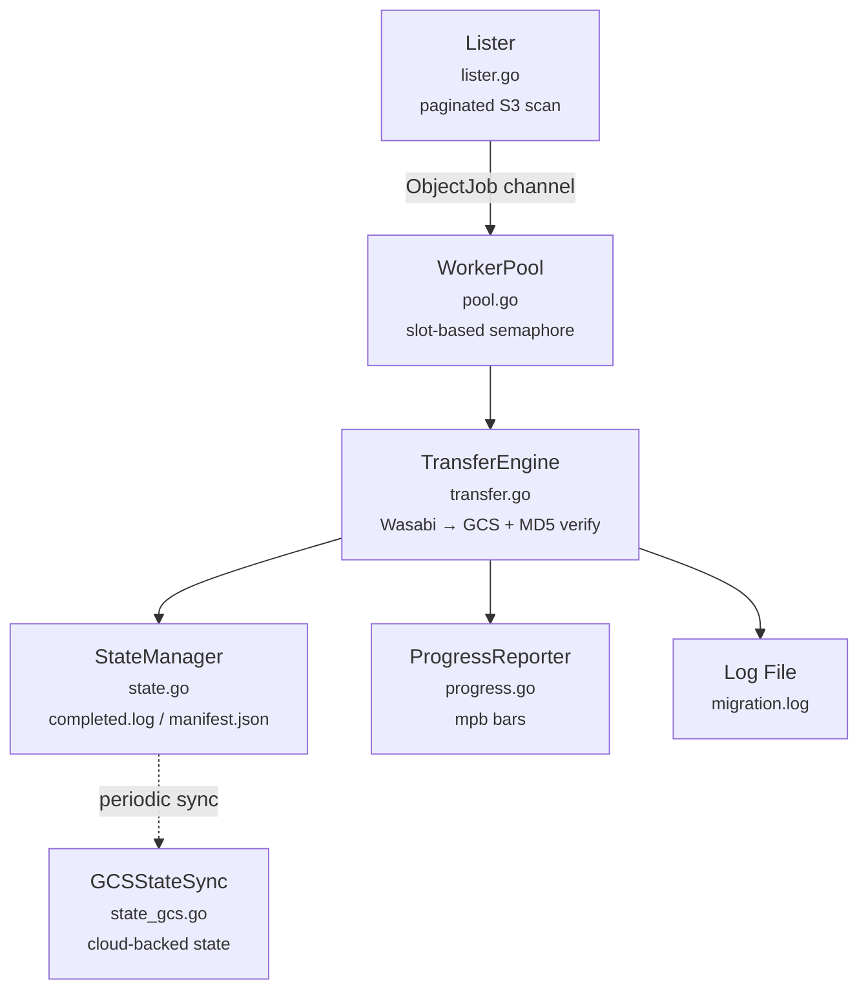

# wasabi-to-gcs

A high-performance CLI tool that migrates objects from [Wasabi](https://wasabi.com/) S3 to [Google Cloud Storage](https://cloud.google.com/storage). Transfers are streamed directly between providers with no local disk buffering, and every object is verified for integrity via MD5 checksums.

Migrations are **resumable** and **idempotent** — interrupted runs pick up exactly where they left off, and re-running the same migration skips objects that have already been transferred.

## Features

- **Streaming transfers** — objects flow directly from Wasabi to GCS with no intermediate disk I/O
- **Concurrent workers** — configurable parallelism (1–128 workers) for maximum throughput
- **Resumable migrations** — append-only state log tracks completed objects; interrupted runs resume seamlessly
- **Cloud-backed state** — optionally sync state to GCS (`--state-gcs`) so migrations can resume across VM teardown/redeploy cycles
- **MD5 integrity verification** — every object's checksum is validated after transfer; corrupt uploads are automatically deleted
- **Real-time progress bars** — per-file and overall progress with transfer speeds, ETA, and byte counts
- **Speedtest mode** — profiles Wasabi download and GCS upload throughput at multiple concurrency levels, identifies the bottleneck, and recommends optimal worker count
- **Dry-run mode** — scan and count objects without transferring anything
- **Prefix filtering** — migrate a subset of objects by key prefix
- **Exponential backoff with jitter** — transient errors (timeouts, 5xx, 429) are retried automatically
- **Graceful shutdown** — SIGINT/SIGTERM finishes in-flight transfers before exiting
- **GCS gRPC transport** — uses the high-performance gRPC client with connection pooling instead of the JSON API

## Installation

### Prerequisites

- **Go 1.25+**
- **Google Cloud credentials** configured via [Application Default Credentials](https://cloud.google.com/docs/authentication/application-default-credentials) (e.g. `gcloud auth application-default login`)
- **Wasabi S3 credentials** (access key and secret key)

### Build from source

```bash
git clone https://github.com/your-org/wasabi-to-gcs.git
cd wasabi-to-gcs
make build
```

This produces the `./wasabi-to-gcs` binary.

## Quick Start

```bash
# Set Wasabi credentials (or pass via flags)
export WASABI_ACCESS_KEY="your-access-key"
export WASABI_SECRET_KEY="your-secret-key"

# Authenticate with GCS
gcloud auth application-default login

# Run the migration
./wasabi-to-gcs \
  --wasabi-endpoint https://s3.us-east-1.wasabisys.com \
  --wasabi-region us-east-1 \
  --wasabi-bucket my-source-bucket \
  --gcs-bucket my-destination-bucket
```

## Usage

```
wasabi-to-gcs [flags]
```

### Flags

#### Source (Wasabi)

| Flag | Description | Required |
|------|-------------|----------|
| `--wasabi-endpoint` | Wasabi S3 endpoint URL | Yes |
| `--wasabi-region` | Wasabi region (e.g. `us-east-1`) | Yes |
| `--wasabi-access-key` | Wasabi access key (or `$WASABI_ACCESS_KEY`) | Yes |
| `--wasabi-secret-key` | Wasabi secret key (or `$WASABI_SECRET_KEY`) | Yes |
| `--wasabi-bucket` | Source bucket name | Yes |

#### Destination (GCS)

| Flag | Description | Required |
|------|-------------|----------|
| `--gcs-project` | GCP project ID | No |
| `--gcs-bucket` | Destination bucket name | Yes |

#### Transfer Options

| Flag | Default | Description |
|------|---------|-------------|
| `--prefix` | _(none)_ | Only migrate objects matching this key prefix |
| `--workers` | `10` | Number of concurrent transfer workers (1–128) |
| `--max-retries` | `3` | Max retry attempts per object (0–10) |
| `--state-dir` | `./migration_state` | Directory for resumable state tracking |
| `--state-gcs` | _(none)_ | GCS location for persistent state (e.g. `gs://bucket/prefix/`) |
| `--dry-run` | `false` | Scan and count objects without transferring |
| `--speedtest` | `false` | Profile throughput and recommend optimal workers |
| `--rescan` | `false` | Force re-scan of source bucket, ignore cached manifest |
| `--force` | `false` | Force restart of a completed migration |

#### Output

| Flag | Default | Description |
|------|---------|-------------|
| `--verbose` | `false` | Show structured log output alongside progress bars |
| `--log-level` | `info` | Log verbosity: `debug`, `info`, `warn`, `error` |

### Environment Variables

| Variable | Maps to |
|----------|---------|
| `WASABI_ACCESS_KEY` | `--wasabi-access-key` |
| `WASABI_SECRET_KEY` | `--wasabi-secret-key` |

Environment variables are used as fallbacks when the corresponding flags are not provided.

## Examples

### Basic migration

```bash
wasabi-to-gcs \
  --wasabi-endpoint https://s3.us-east-1.wasabisys.com \
  --wasabi-region us-east-1 \
  --wasabi-bucket my-source \
  --gcs-bucket my-destination
```

### Migrate a specific prefix with more workers

```bash
wasabi-to-gcs \
  --wasabi-endpoint https://s3.us-east-1.wasabisys.com \
  --wasabi-region us-east-1 \
  --wasabi-bucket my-source \
  --gcs-bucket my-destination \
  --prefix "images/" \
  --workers 20
```

### Dry run

Preview what would be transferred without moving any data:

```bash
wasabi-to-gcs \
  --wasabi-endpoint https://s3.us-east-1.wasabisys.com \
  --wasabi-region us-east-1 \
  --wasabi-bucket my-source \
  --gcs-bucket my-destination \
  --dry-run
```

### Speedtest

Profile throughput at multiple concurrency levels to find the optimal worker count:

```bash
wasabi-to-gcs \
  --wasabi-endpoint https://s3.us-east-1.wasabisys.com \
  --wasabi-region us-east-1 \
  --wasabi-bucket my-source \
  --gcs-bucket my-destination \
  --speedtest
```

The speedtest measures Wasabi download and GCS upload throughput at concurrency levels 1, 2, 4, 8, 16, and 32 (with early stopping when throughput plateaus). It also runs an internet baseline test via Cloudflare for context. The output identifies which service is the bottleneck and recommends an optimal `--workers` value.

### Resume with a fresh scan

If the source bucket contents have changed since the last run:

```bash
wasabi-to-gcs \
  --wasabi-endpoint https://s3.us-east-1.wasabisys.com \
  --wasabi-region us-east-1 \
  --wasabi-bucket my-source \
  --gcs-bucket my-destination \
  --rescan
```

### Re-run a completed migration

Force a full migration even if a previous run completed successfully:

```bash
wasabi-to-gcs \
  --wasabi-endpoint https://s3.us-east-1.wasabisys.com \
  --wasabi-region us-east-1 \
  --wasabi-bucket my-source \
  --gcs-bucket my-destination \
  --force
```

## Architecture



### Components

| File | Responsibility |
|------|---------------|
| `main.go` | CLI setup (Cobra), signal handling, migration orchestration |
| `config.go` | Configuration struct, validation, error sentinels |
| `clients.go` | Wasabi S3 and GCS client initialization with connection pooling |
| `lister.go` | Paginated S3 ListObjectsV2 scan; streams `ObjectJob`s into a bounded channel |
| `pool.go` | Slot-based semaphore concurrency with errgroup; maps slot IDs to per-worker progress bars |
| `transfer.go` | Streaming Wasabi-to-GCS transfer with MD5 verification, size checks, and exponential backoff |
| `state.go` | Append-only `completed.log` (TSV) + `manifest.json` for scan totals; enables resumability |
| `state_gcs.go` | Downloads/uploads state files to GCS for cross-VM resume; periodic sync every 30s + final upload on shutdown |
| `progress.go` | mpb-based progress: overall bar + dynamic per-file bars; stderr redirection for clean output |
| `speedtest.go` | Worker scaling analysis across concurrency levels with throughput measurement |

### Design Decisions

- **GCS gRPC client** — uses `storage.NewGRPCClient` with connection pooling for higher throughput than the JSON API
- **Streaming, not staging** — objects are piped directly from Wasabi HTTP response to GCS writer with 1 MB buffers from a `sync.Pool`; no temp files
- **Per-page progress updates** — the lister updates progress bar totals after each S3 page so workers can start immediately without waiting for a full bucket scan
- **Multipart ETag handling** — ETags containing `-` (multipart uploads) skip MD5 verification since they aren't single-object MD5 hashes
- **Fatal vs. transient errors** — bad credentials and missing buckets abort the entire migration immediately; network errors and rate limits trigger retries
- **stderr fd duplication** — the real stderr fd is preserved for mpb rendering while library noise (gRPC, GCS SDK) is redirected to the log file

## State Directory

The state directory (`./migration_state` by default) contains:

| File | Format | Purpose |
|------|--------|---------|
| `completed.log` | TSV (timestamp, key, size, md5) | Append-only record of successfully transferred objects |
| `manifest.json` | JSON | Cached scan totals and metadata from the source bucket |
| `migration.log` | Text | Structured log output from the migration run |

The state directory is what enables resumability. On subsequent runs, already-completed keys are skipped. If the bucket name or prefix changes, the cached manifest is automatically discarded.

To start fresh, either delete the state directory or use `--force`.

### Cloud-backed state with `--state-gcs`

By default, state lives only on the local filesystem. If you're running on ephemeral VMs, use `--state-gcs` to persist state to a GCS bucket:

```bash
wasabi-to-gcs \
  --wasabi-endpoint https://s3.us-east-1.wasabisys.com \
  --wasabi-region us-east-1 \
  --wasabi-bucket my-source \
  --gcs-bucket my-destination \
  --state-gcs gs://my-bucket/migration-state/
```

On startup, state files are downloaded from GCS into the local `--state-dir`. During the migration, state is synced to GCS every 30 seconds. On shutdown, a final sync ensures the remote state is up to date. This allows you to tear down a VM and resume the migration later on a new one.

## Development

```bash
make build            # Build binary → ./wasabi-to-gcs
make test             # Run tests (short mode)
make test-race        # Run tests with race detector
make test-integration # Run integration tests (requires -tags=integration)
make test-coverage    # Generate test coverage report
make lint             # Run golangci-lint
make tidy             # go mod tidy
make clean            # Remove build artifacts
```

## Running on a GCP VM

Running this tool on a GCP VM gives 10–50x faster transfers compared to a home network. Instead of being bottlenecked by residential upload speeds (e.g. 14 Mbps), a VM in the same region as your GCS bucket gets multi-Gbps cloud-to-cloud throughput.

### Prerequisites

- **`gcloud` CLI** installed and configured (`gcloud auth login`)
- **`WASABI_ACCESS_KEY`** and **`WASABI_SECRET_KEY`** exported in your local shell

### Workflow

```bash
# 1. Build the Linux binary
make build-linux

# 2. Create a VM and deploy the binary + credentials + state
make deploy

# 3. SSH into the VM
make ssh

# 4. On the VM: run the migration
source ~/.env
./wasabi-to-gcs-linux \
  --wasabi-endpoint https://s3.us-east-1.wasabisys.com \
  --wasabi-region us-east-1 \
  --wasabi-bucket my-source \
  --gcs-bucket my-destination \
  --workers 20

# 5. When done, delete the VM
make teardown
```

### Overriding VM Settings

The defaults are `VM_NAME=wasabi-migrator`, `VM_ZONE=us-east1-b`, `VM_TYPE=e2-standard-2`. Override any of them:

```bash
make deploy VM_NAME=my-vm VM_ZONE=us-central1-a VM_TYPE=e2-standard-4
make ssh VM_NAME=my-vm VM_ZONE=us-central1-a
make teardown VM_NAME=my-vm VM_ZONE=us-central1-a
```

### Tip: Use tmux for Long Migrations

Start a `tmux` session so the migration keeps running if you disconnect:

```bash
# On the VM after make ssh:
tmux new -s migrate
source ~/.env
./wasabi-to-gcs-linux --wasabi-endpoint ... --gcs-bucket ...

# Detach: Ctrl-b d
# Reconnect later: make ssh, then tmux attach -t migrate
```

## Authentication

### Wasabi

Provide your Wasabi S3 credentials via CLI flags or environment variables:

```bash
# Via environment variables (recommended)
export WASABI_ACCESS_KEY="your-access-key"
export WASABI_SECRET_KEY="your-secret-key"

# Or via flags
--wasabi-access-key "your-access-key" --wasabi-secret-key "your-secret-key"
```

### Google Cloud Storage

GCS authentication uses [Application Default Credentials](https://cloud.google.com/docs/authentication/application-default-credentials). The most common ways to set this up:

```bash
# For local development — interactive login
gcloud auth application-default login

# For service accounts — set the credentials file path
export GOOGLE_APPLICATION_CREDENTIALS="/path/to/service-account-key.json"

# On GCE/GKE — uses the attached service account automatically
```

No GCS-specific flags are needed. The `--gcs-project` flag is optional and only required if it cannot be inferred from your credentials.
